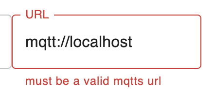
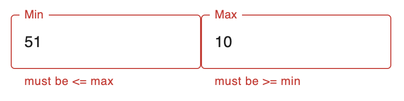
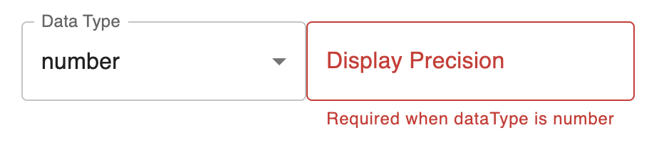

# Custom Validation

In your form schema, use [`.refine`](https://zod.dev/?id=refine) and [`.superRefine`](https://zod.dev/?id=superrefine)
for field validation.

## Validating a Single Field

[`.refine`](https://zod.dev/?id=refine) is convenient for single-field validation:

```ts
const schema = z.object({
  serverUrl: z
    .string()
    .url()
    .optional()
    .refine((url) => {
      try {
        return url == null || new URL(url).protocol === 'mqtts'
      } catch {
        return false
      }
    }, 'must be a valid mqtts url'),
})
```



## Comparing Fields

To validate one field against another, use [`.superRefine`](https://zod.dev/?id=superrefine):

```ts
const schema = z
  .object({
    min: z.number().finite(),
    max: z.number().finite(),
  })
  .superRefine(({ min, max }, ctx) => {
    if (min > max) {
      ctx.addIssue({
        code: z.ZodIssueCode.custom,
        path: [...ctx.path, 'min'],
        message: 'must be <= max',
      })
      ctx.addIssue({
        code: z.ZodIssueCode.custom,
        path: [...ctx.path, 'max'],
        message: 'must be >= min',
      })
    }
  })
```



## Conditional Validation

You can use [`.superRefine`](https://zod.dev/?id=superrefine) to only validate one field when another is defined:

```ts
const schema = z
  .object({
    dataType: z.enum(['string', 'number']),
    displayPrecision: z.number().finite().optional(),
  })
  .superRefine(({ dataType, displayPrecision }, ctx) => {
    if (dataType === 'number' && displayPrecision == null) {
      ctx.addIssue({
        code: z.ZodIssueCode.custom,
        path: [...ctx.path, 'displayPrecision'],
        message: 'Required when dataType is number',
      })
    }
  })
```



